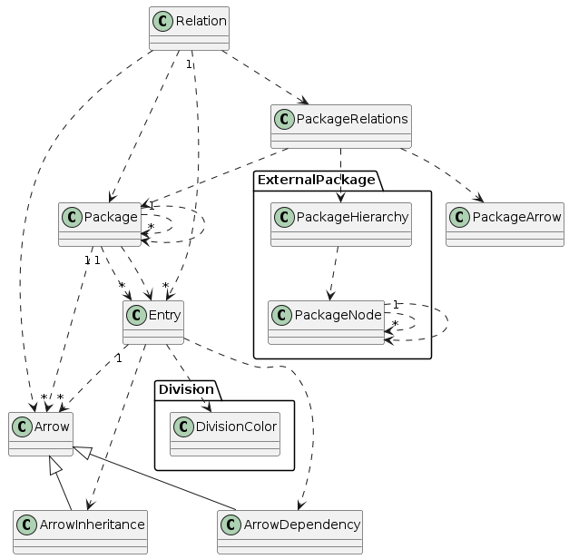
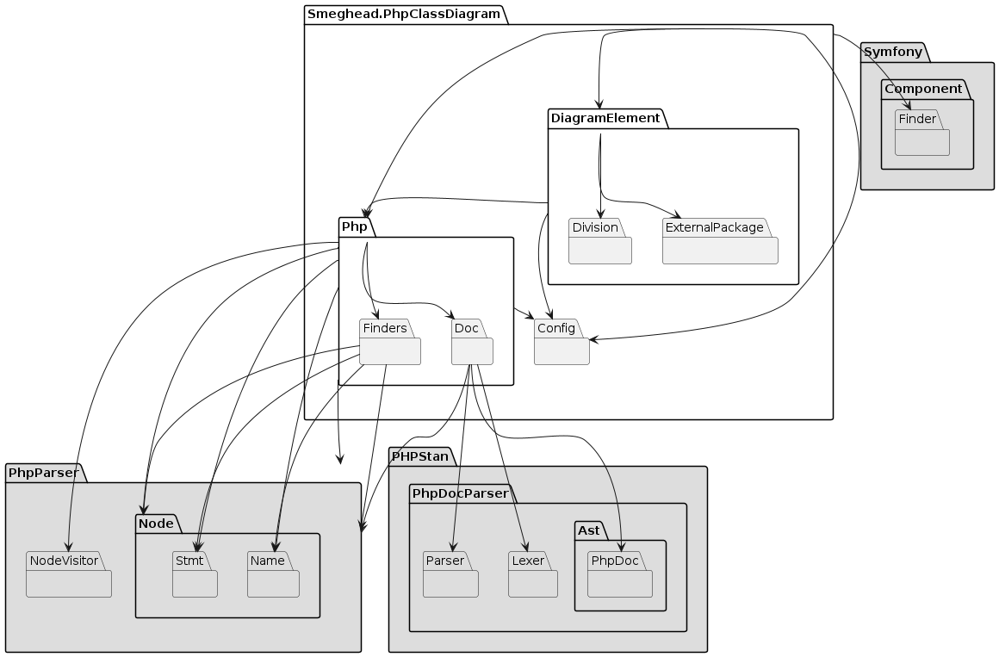
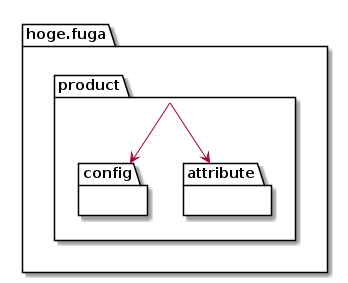
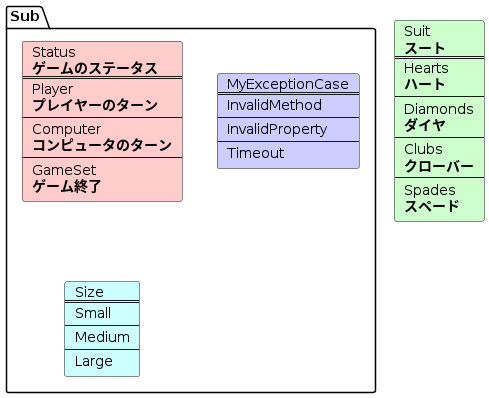

# php-class-diagram

A CLI tool that parses the PHP source directory and generates PlantUML class diagram scripts as output.

 [](https://packagist.org/packages/smeghead/php-class-diagram) [](https://packagist.org/packages/smeghead/php-class-diagram) [](https://packagist.org/packages/smeghead/php-class-diagram) [](https://packagist.org/packages/smeghead/php-class-diagram) [](https://packagist.org/packages/smeghead/php-class-diagram)

## Features

 * ♻️ Generating class diagrams from source code contributes to continuous design improvement.
 * 🔖  It produces expressive class diagrams with a focus on namespaces and relationships.
 * 🌐 Diagrams are interactive hypermedia tools, allowing you to click on class boxes to navigate directly to the source code, enhancing understanding both visually and interactively.
 * 🔧 This simple CLI tool is easy to use.
 * 💡 Additionally, it can generate a package relationship diagram to visualize dependencies on external namespaces.

## What is PlantUML

> [PlantUML - Wikipedia](https://en.wikipedia.org/wiki/PlantUML)
> PlantUML is an open-source tool allowing users to create diagrams from a plain text language. Besides various UML diagrams, PlantUML has support for various other software development related formats (such as Archimate, Block diagram, BPMN, C4, Computer network diagram, ERD, Gantt chart, Mind map, and WBD), as well as visualisation of JSON and YAML files.

## Hypermedia Feature

One of the standout features of this tool is the ability to generate class diagrams with clickable links that navigate directly to the source code of those classes. This transforms the diagrams into interactive hypermedia tools, enhancing the understanding of the source code visually and interactively.

To enable this feature, generate the diagrams in SVG format and use the `--svg-topurl` option to specify the base URL for the links:

```shell
$ vendor/bin/php-class-diagram \
    --svg-topurl='https://github.com/your-username/your-repo/blob/main/path/to/source' \
    path/to/php/files
```

To embed the SVG diagrams in HTML while preserving the clickable links, use the `embed` or `object` tags instead of `img`. Here’s an example:

```html
<html lang="en">
<head>
    <title>PHP Class Diagram</title>
    <meta name="viewport" content="width=device-width, initial-scale=1.0">
    <style>
        embed {
            max-width: 100%;
            max-height: 200%;
            width: auto;
            height: auto;
        }
    </style>
</head>
<body>
    <embed type="image/svg+xml" src="php-class-diagram.svg"/>
</body>
</html>
```

This ensures that the SVG image is responsive and the hyperlinks remain functional.

[Hypermedia example](https://smeghead.github.io/php-class-diagram/hyper-media.html)

## Dogfooding

### php-class-diagram class diagram (linked SVG file)


### php-class-diagram class diagram without fields and methods

If your analysis primarily focuses on the relationships between classes, a simpler notation may be more appropriate.



### php-class-diagram package related diagram

Visualizing package relationships can uncover critical design issues.



## Install

### From DockerHub

You can utilize a Docker image that includes php-class-diagram and PlantUML from the following URL.

 * https://hub.docker.com/r/smeghead7/php-class-diagram

### From Composer

```bash
$ mkdir example
$ cd example
$ composer init
$ composer require --dev smeghead/php-class-diagram
```

Now, you can execute `./vendor/bin/php-class-diagram`.
For instance, try to display help message.

```bash
$ vendor/bin/php-class-diagram --help
usage: php-class-diagram [OPTIONS] <target php source directory>

A CLI tool that parses the PHP source directory and generates PlantUML class diagram scripts as output.

OPTIONS
  -h, --help                       show this help page.
  -v, --version                    show version.
      --class-diagram              output class diagram script. (default)
      --package-diagram            output package diagram script.
      --division-diagram           output division diagram script.
      --jig-diagram                output class diagram and package diagram script.
      --enable-class-properties    describe properties in class diagram. (default)
      --disable-class-properties   not describe properties in class diagram.
      --enable-class-methods       describe methods in class diagram. (default)
      --disable-class-methods      not describe methods in class diagram.
      --enable-class-name-summary  describe classname with Class summary of document comment. (default)
      --disable-class-name-summary describe classname without Class summary of document comment.
      --hide-private               hide private properties and methods.
      --hide-private-properties    hide private properties.
      --hide-private-methods       hide private methods.
      --svg-topurl='url'           Specifies the top URL when displaying the class as a link when outputting in SVG format.
      --header='header string'     additional header string. You can specify multiple header values.
      --include='wildcard'         include target file pattern. (default: `*.php`) You can specify multiple include patterns.
      --exclude='wildcard'         exclude target file pattern. You can specify multiple exclude patterns.
```

## How to execute

### Class Diagram

If there are three PHP source files in the directory test/fixtures/no-namespace each with a TYPE comment,

 * php source files.

```
└─test
    └─fixtures
        └─no-namespace
            └─product
                    Product.php
                    Name.php
                    Price.php
```

 * Product.php
```php
<?php
class Product {
    /** @var Name   product name. */
    private $name;
    /** @var Price  price of product. */
    private $price;
}
```

 * Name.php
```php
<?php
class Name {
    /** @var string  name. */
    private $name;
}
```

 * Price.php
```php
<?php
class Price {
    /** @var int  price. */
    private int $price;
}
```

Executing `php-class-diagram` will output the PlantUML script.

```bash
$ vendor/bin/php-class-diagram test/fixtures/no-namespace
@startuml class-diagram
  package product as product {
    class "Price" as product_Price {
      -price : int
    }
    class "Name" as product_Name {
      -name : string
    }
    class "Product" as product_Product {
      -name : Name
      -price : Price
      +method1(param1)
    }
  }
  product_Product ..> product_Name
  product_Product ..> product_Price
  product_Product ..> product_Product
@enduml
```

Use PlantUML to convert the PlantUML script to an image.


#### option `header`

You can specify the string to be output to the PlantUML header.

```bash
$ vendor/bin/php-class-diagram \
    --header='title "This is the class diagram"' \
    path/to/src
```

#### option `include`

You can add patterns to specify the target files for processing.

```bash
$ vendor/bin/php-class-diagram \
    --include='*.php' \
    --include='*.php4' \
    path/to/src
```

#### option `exclude`

You can specify patterns to exclude files from the processing.

```bash
$ vendor/bin/php-class-diagram \
    --exclude='test' \
    --exclude='*Exception.php' \
    path/to/src
```

### Package Diagram

You can visualize package dependencies by creating a package relationship diagram using php-class-diagram.

```bash
$ vendor/bin/php-class-diagram --package-diagram test/fixtures/dependency-loops
@startuml package-related-diagram
  package hoge.fuga as ROOT {
    package product as product {
      package attribute as product.attribute {
      }
      package config as product.config {
      }
    }
  }
  product --> product.attribute
  product <-[#red,plain,thickness=4]-> product.config
@enduml
```

Packages that depend on each other are undesirable.
If the tool detects such dependencies, it will issue a warning with a thick red line.





### Division Diagram

If you are utilizing the Enum feature introduced in PHP 8.1, you can generate the division diagram.
Visualizing the divisions employed in the program can be beneficial for research and design purposes.

```bash
$ bin/php-class-diagram --division-diagram test/fixtures/enum/ 
@startuml division-diagram
  card Suit #ccffcc [
    Suit
    <b>スート</b>
    ====
    Hearts
    <b>ハート</b>
    ----
    Diamonds
    <b>ダイヤ</b>
    ----
    Clubs
    <b>クローバー</b>
    ----
    Spades
    <b>スペード</b>
  ]
  package Sub as Sub {
    card Status #ffcccc [
      Status
      <b>ゲームのステータス</b>
      ====
      Player
      <b>プレイヤーのターン</b>
      ----
      Computer
      <b>コンピュータのターン</b>
      ----
      GameSet
      <b>ゲーム終了</b>
    ]
    card MyExceptionCase #ccccff [
      MyExceptionCase
      ====
      InvalidMethod
      ----
      InvalidProperty
      ----
      Timeout
    ]
    card Size #ccffff [
      Size
      ====
      Small
      ----
      Medium
      ----
      Large
    ]
  }
@enduml
```




## GitHub Actions support

The following repository provides actions for generating class diagrams using php-class-diagram in GitHub Actions workflows.

[smeghead/php-class-diagram-gh-action](https://github.com/smeghead/php-class-diagram-gh-action)


## Development

### Open shell

```bash
docker compose build
docker compose run --rm php_cli bash
```

### install dependencies

```bash
composer install
```

### execute tests

```bash
composer test
```

## CONTRIBUTING

Both Issues and Pull Requests are welcome!
